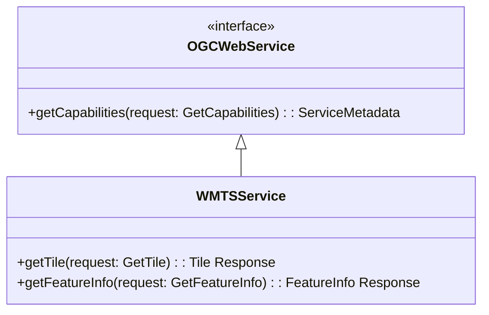

WMTS 서비스를 제공하는 목적은 **성능 중심적이며 확장 가능한** 시스템을 만드는 것입니다. 따라서 서버는 **타일을 빠르게 반환**할 수 있어야 합니다.  
이를 위한 좋은 방법은 **미리 렌더링된 타일을 로컬에 저장해두고**, 추가적인 이미지 처리나 지리적 처리 없이 제공하는 것입니다.

서버 개발자는 타일을 **사전 준비 과정에서 생성**할지, 아니면 **요청 시 동적으로 생성하고 캐싱 메커니즘을 활용**할지 결정해야 합니다.

타일 기반 맵핑의 특성상, 대부분의 클라이언트는 **여러 개의 타일을 동시에 요청**해 하나의 화면을 구성하므로, 서버는 **비동기적인 타일 접근**을 처리할 수 있어야 합니다.

---

### 🎯 WMTS 서비스의 목적

- 지도를 **개별 타일로 나누어 제공**하는 것입니다.

WMTS 인터페이스는 **두 가지 아키텍처 스타일**(리소스 지향 / 절차 지향) 중 하나로 클라이언트가 다음 세 가지 자원(Resource)을 요청할 수 있게 합니다:

---

### 🧱 제공되는 자원 및 연산 (Operations)

1. **ServiceMetadata 리소스**
   - 절차 지향 방식의 `GetCapabilities` 요청에 대한 응답
   - **필수 구현 항목**
   - 서버가 지원하는 기능 및 보유 정보에 대해 설명
   - 이 연산은 클라이언트-서버 간 사용 중인 표준 버전을 협상하는 데도 사용됨
2. **Tile 리소스**
   - 절차 지향 방식의 `GetTile` 요청에 대한 응답
   - **필수 구현 항목**
   - 특정 레이어의 지도 조각(타일)을 반환
3. **FeatureInfo 리소스**
   - 절차 지향 방식의 `GetFeatureInfo` 요청에 대한 응답
   - **선택적 구현 항목**
   - 특정 타일의 픽셀 위치에 있는 객체의 속성 정보를 제공
   - 예: 주제 속성 이름과 값 쌍 등 텍스트 형태의 설명 제공 (WMS의 `GetFeatureInfo`와 유사)

---

### 🧩 OGC의 다른 웹 서비스와의 관계

WMTS 인터페이스는 WMS, WFS, WCS 등 **다른 OGC 웹 서비스들과 유사한 구조**를 갖습니다.  
WMTS에서 공통적으로 사용되는 많은 요소는  
**[OGC 06-121r3] 문서 (OpenGIS Web Services 공통 구현 명세)**에 정의되어 있으며,  
이 표준에서는 중복을 피하기 위해 해당 문서를 참조하여 사용합니다.

---

### 📊 UML 다이어그램

- **Figure 1**은 절차 지향 방식에서의 WMTS 인터페이스 구조를 UML로 간략히 표현한 것입니다.
- 이 클래스 다이어그램에 따르면, WMTS 인터페이스 클래스는 `OGCWebService` 인터페이스로부터 `getCapabilities` 연산을 상속받고, 여기에 `getTile`과 `getFeatureInfo` 연산을 추가합니다.
- 더 상세한 UML 모델은 **부록 C**에 제공됩니다.



- 각 서버 인스턴스는 이 클래스(WMTSService)의 객체를 하나만 개념적으로 생성하며, 이 객체는 서버가 사용 가능한 동안 항상 존재함.

---

### WMTS는 하나의 레이어에 대한 단일 타일을 제공한다

WMTS는 지도에서 **하나의 레이어에 대한 하나의 타일**만 제공합니다.  
WMS와 달리, **여러 레이어의 정보를 조합하여 하나의 타일로 반환하는 방식은 정의되어 있지 않습니다.**  
따라서, 여러 레이어를 조합해 보여주고 싶은 WMTS 클라이언트는 **각 레이어의 타일을 개별적으로 요청한 후, 클라이언트 측에서 병합하거나 오버레이해야 합니다.**

또한 WMTS 타일의 **경계 상자(Bounding Box)**와 **축척(Scale)**은 **이산적인(정해진)** 값의 집합으로 제한됩니다.

---

### 6.1 타일 매트릭스 세트 (Tile Matrix Set) – 타일 공간의 기하 구조

타일로 구성된 지도 레이어에서 공간 표현은 일정한 이산(discrete) 파라미터에 의해 제한됩니다.  
이러한 파라미터를 정의하는 것이 바로 **타일 매트릭스 세트(Tile Matrix Set)**입니다.

각 타일 매트릭스 세트는 하나 이상의 **타일 매트릭스(Tile Matrix)**로 구성되며, **각 좌표 참조계(CRS)**에 대해 사용 가능한 타일을 정의합니다.

각 타일 매트릭스는 다음을 정의합니다:

#### a) 타일의 축척 (Scale Denominator)

- 축척은 **기준 픽셀 크기**인 `0.28mm × 0.28mm`를 기반으로 정의됩니다. 이 정의는 WMS 1.3.0 및 Symbology Encoding 1.1.0과 동일합니다.
- 실제 디스플레이의 픽셀 크기를 알 수 없는 경우가 많기 때문에, `0.28mm`는 일반적으로 사용되는 값입니다.

#### b) 타일의 픽셀 단위 너비와 높이

#### c) 타일 매트릭스의 좌상단 좌표

- 좌표 참조계(CRS) 기준의 **타일 매트릭스의 좌상단 (최소 x, 최대 y)** 위치입니다.
- 이는 **가장 왼쪽 상단 타일의 가장 왼쪽 상단 픽셀 좌표**입니다.

#### d) 타일 매트릭스의 가로 × 세로 타일 수

- 즉, 매트릭스 내에 존재하는 **타일의 개수**
- 서버가 특정 레이어에 대해 제공하는 타일 매트릭스 세트의 총 수는 다음 공식으로 계산됩니다:
  - **차원이 없는 경우:** `nTileMatrices × nTiledStyles × nTiledFormats`
  - **차원이 정의된 경우:** `nTileMatrices × nTiledStyles × nTiledFormats × nTiledDimensions`
- 각 타일 매트릭스 세트 내의 특정 축척에 대해 존재하는 타일 수는: `matrixWidth × matrixHeight`

---

### 타일 매트릭스 세트 구성

- 각 타일 매트릭스 세트는 **하나 이상의 타일 매트릭스 집합**으로 구성됩니다.
- 각 타일 매트릭스는 특정 축척에 최적화된 해상도를 가지며, 고유 식별자(`tileMatrix identifier`)로 구분됩니다.
- 타일 매트릭스 세트는 **(옵션) 근사 bounding box**를 가질 수 있으며, 각 타일 매트릭스는 다른 파라미터를 통해 유도된 **정확한 bounding box**를 가집니다.

> 클라이언트와 서버는 픽셀 정렬(pixal alignment)에 따른 미세한 차이를 고려해야 합니다.

---

### 타일 매트릭스 Bounding Box 계산식

- 변수:
  - `tileMatrixMinX`, `tileMatrixMaxY`: 좌상단 좌표
  - `matrixWidth`, `matrixHeight`: 타일 매트릭스 너비와 높이
  - `tileWidth`, `tileHeight`: 타일 크기 (픽셀)
  - `metersPerUnit`: 좌표 참조 시스템(CRS) 단위 → 미터 변환 계수
  - `scaleDenominator`: 축척 값
- 우측 하단 점 계산:

```
pixelSpan = scaleDenominator × 0.28 × 10⁻³ / metersPerUnit
tileSpanX = tileWidth × pixelSpan
tileSpanY = tileHeight × pixelSpan
tileMatrixMaxX = tileMatrixMinX + (tileSpanX × matrixWidth)
tileMatrixMinY = tileMatrixMaxY - (tileSpanY × matrixHeight)
```

## ![[Pasted image 20250408154041.png]]

타일 매트릭스 내의 각 타일은 `TileCol`(열)과 `TileRow`(행) 인덱스로 식별되며, 인덱스의 원점 `(0,0)`은 타일 매트릭스의 좌측 상단 모서리 옆에 있는 타일을 기준으로 하고, 각각 오른쪽과 아래쪽 방향으로 증가합니다(그림 2 참조).

이 문서의 부록 H에는 경계 상자 사각형을 덮는 타일 인덱스를 얻는 과정과, 타일을 둘러싸는 CRS 좌표를 계산하는 과정을 보여주는 의사 코드(pseudo code)가 포함되어 있습니다.

> **참고 1**: 정사각형이 아닌 픽셀(비정방형 픽셀)은 지원되지 않습니다. 이는 WMS(Web Map Service)와는 다른 점인데, WMS는 비정방형 픽셀을 허용하지만, 많은 구현체들이 이를 제대로 지원하지 못합니다.

타일드 레이어(tiled layer)는 `tileMatrixSet` URI를 통해 자신의 타일 매트릭스 집합과 연결되며, 이 URI는 앞서 설명한 대로 완전히 정의된 `TileMatrixSet` 섹션을 가리킵니다.

레이어는 이 레이어의 실제 콘텐츠에 맞춰 조정된 특정 지역을 설명하는 전용 `TileMatrixSet`을 사용할 수 있습니다. 이 경우, 선택 사항인 `tileMatrixSetLimits` 섹션은 사용되지 않으며, 레이어의 공간 범위(spatial extent)가 변경되면 레이어의 최소 경계 상자(minimum bounding box)에 영향을 주게 되어, 각 `TileMatrix`의 `TopLeftCorner`를 다시 정의해야 하고, 결과적으로 `TileCol`, `TileRow` 인덱스가 변경되어 기존에 캐시된 타일들이 무효화될 수 있습니다.

이러한 문제를 피하기 위해, 레이어는 보다 넓은 범위(혹은 전 세계 범위)를 포함하는 범용적인 `TileMatrixSet`을 선택적으로 사용할 수 있습니다. 실제로 이 `TileMatrixSet`은 해당 레이어가 미래에 덮을 수 있는 지역을 정의하며, 서버 내의 여러 레이어 간에 쉽게 공유될 수 있습니다.

클라이언트에게 유효한 `TileCol` 및 `TileRow` 인덱스 범위를 알리기 위해, 레이어 정의에서는 선택적으로 `tileMatrixSetLimits` 섹션을 사용할 수 있으며, 이 섹션은 각 `TileMatrix`에 대해 인덱스의 최소값과 최대값을 지정합니다. 이 범위를 벗어난 요청은 서버 예외를 반환하게 됩니다(그림 6 참조).

## ![[Pasted image 20250408154349.png]]

### 🔺 다른 표준에서의 유사 개념

다른 표준에서는 이러한 방식의 공간 분할을 **이미지 피라미드(image pyramid)**라고 부릅니다.

- 예: **KML 2.2**의 조항 11.6 [OGC 07-147r2]
- **JPEG2000 (ISO/IEC 15444-1)** 와 **JPIP (ISO/IEC 15444-9)**도 유사한 개념인 **해상도 수준(resolution levels)**을 사용합니다.

그러나 이런 방식들은 일반적으로 다음과 같은 특징을 가집니다:

- 가장 상세한 타일 매트릭스를 기준으로 시작하여,
- 4개의 타일을 결합하여 다음 해상도의 타일을 만드는 방식으로 구성됨
- 따라서 해상도는 **2의 제곱 단위(powers of two)**로 변화하며, 타일들이 하위 해상도 타일과 **정확히 겹치는(overlap)** 구조를 가집니다.
- 구조가 매우 **엄격(rigid)**합니다.

➡️ 반면 **WMTS는 더 유연**한 구조를 가지고 있으며, **KML SuperOverlay**, **JPEG2000 기반 구현체**에서도 **WMTS를 통해 타일 매트릭스를 정의하고 타일을 제공**할 수 있습니다.

> Annex E.3 및 E.4에서 2의 제곱 기반 스케일 집합 예시를 볼 수 있습니다.

---

### 📌 클라이언트와 서버 연산 주의사항

> 💡 **NOTE 2**  
> 클라이언트와 서버는 **부동소수점 비교 시 정밀도와 허용 오차(tolerance)**에 유의해야 합니다.  
> (예: double precision 사용 — 최대 16자리)

---

## 📐 6.2 Well-known Scale Sets (잘 알려진 스케일 집합)

**WMTS 서버는 미리 정의된 타일만 제공**하기 때문에,

- 제한된 좌표계(CRS)와 축척(Scale)만 지원합니다.
- WMS처럼 요청에 따라 임의의 영역을 생성하지 않습니다.

➡️ 따라서, 단순한 클라이언트(WMTS 전용 클라이언트)는 좌표계 변환이나 스케일 변환을 하지 못할 수 있으며, **다른 서버의 타일을 오버레이하는 것이 어려울 수 있습니다.**

이를 해결하기 위해 **공통의 좌표계 및 스케일 집합**을 정의한 것이 바로 **well-known scale set (잘 알려진 스케일 집합)**입니다.

---

### ✅ 목적 및 이점

- 서로 다른 WMTS 서버 간의 **호환성(interoperability)**을 높임
- 클라이언트가 특정 스케일 집합에만 대응 가능할 경우 서버의 스케일 집합이 호환되는지 **빠르게 확인 가능**
- 예: Google Maps 위에 WMTS 타일을 오버레이하는 앱은 Google 스케일과 좌표계가 같은 서버만 수용 가능

---

### 🔗 정의 방식

- TileMatrixSet은 **하나의 well-known scale set을 참조**합니다.
- 클라이언트는 서버가 동일한 스케일 집합을 지원하는지 확인하면 **호환 가능 여부를 즉시 파악**할 수 있습니다.
- 서버들은 서로 간의 호환성을 고려하여 잘 알려진 스케일 집합을 채택하게 될 유인이 생깁니다.

> Annex E에 여러 개의 well-known scale sets가 예시로 포함되어 있으며, 향후 더 많은 스케일 집합이 추가될 수 있습니다.

---

> 💡 **NOTE 1**  
> 엄밀히 말하면, **well-known scale set은 없어도 호환성 확보는 가능**합니다.  
> 클라이언트는 실제로 서버가 제공하는 CRS/Scale 목록을 분석해 호환 여부를 판단할 수 있기 때문입니다.  
> 하지만 well-known scale set은 **편의성**을 제공하기 위한 메커니즘입니다.

---
